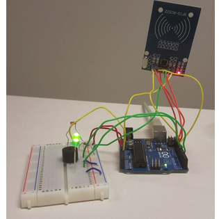
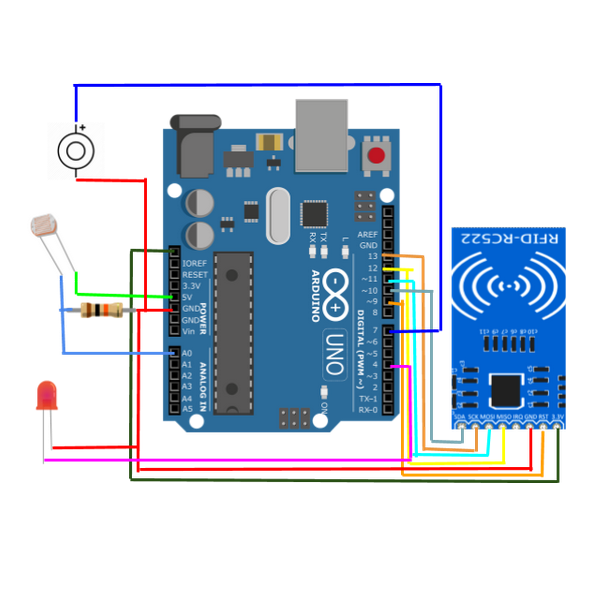

Why an Anti-Theft Backpack? 
---

During the Fall 2018 semester, Kelsey Fukushima, Taylor Inong, and I designed and created a device which protects a backpack from pickpocketing by sensing when bag is open and alerting wearer with an alarm. 

Right off the bat we knew we wanted to create a project that incorporated fashion in some way, because we believed that this would be different from some of the projects that have been completed before in this class. We started looking up project ideas online; we liked the projects that lit up and made sound, so we knew we wanted to include these things into our project. Some of these things included holiday decorations or clothes that lit up. However, we also wanted to create something that had practical use. We came up with the idea of making a device that acted in a similar way to a car alarm for a backpack. The device would alert the owner that the object was being handled in an unauthorized way by emitting an alarm. This alarm could only be deactivated with a key. 
 Image Credit: [Arduino Website](https://www.arduino.cc/en/Trademark/HomePage) and [Arduino Logo](https://commons.wikimedia.org/wiki/File:Arduino_Logo.svg)

What did I do?
---

Over the course of the semester, we met weekly; we all relied on each other for different components of the project. I contributed to this project by researching information on existing anti-theft technologies and RFID capabilities, as well as handpicking some of the materials used in the final design. My most meaningful additions were to plan and write some of the code, and to script, record, and edit footage to create the video summary of project. 

```
```


What did I learn?  
---

Because of this project, I was introduced to technologies that I have never directly worked with before: Arduino hardware and RFID technology, and the Arduino IDE. It was inspiring to be able to create a functional product without much technical knowledge; it goes to show what can happen with creativity and determination. Additionally, this project changed my perspective on how I interact with the world; I started to notice how my actions were being trained by different feedback, like how the button on a vending machine lights up after I press it. I began look for things that I could incorporate into our device. In the future we may incorporate different multicolor LEDs; we may use a red LED to show the incorrect key was used, and a green LED to show that the correct key was used. Alternatively, we could use an LCD screen to show more detailed information. 


You can watch our video on [Youtube](https://youtu.be/lRN41nCLZMQ).


