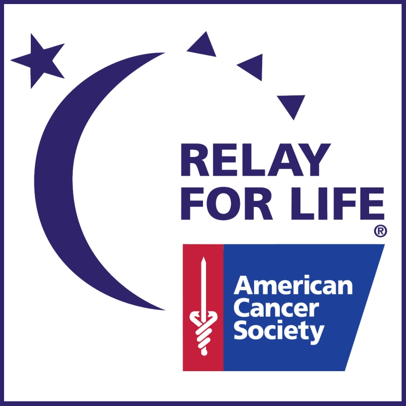

 

What is Relay For Life? 
---
It is a fundraising cancer walk in which team members walk around a track to raise money for the American Cancer Society. Each event is volunteer run and can last anywhere from 6 to 24 hours in length, during which each team is asked to have at least one member relaying at all times to signify that cancer never sleeps. Any money raised during the event (activities and games, sale of food) will contribute to event's fundraising goal. Additionally, a memorable Luminaria Ceremony is conducted to honor those in the community who are survivors and those who have lost the battle to cancer.

A light purple or lavender ribbon is generally used to represent all cancers as a whole. Some relays try to incorporate a theme, usually centered around the color purple, to add some flair to their event. The theme for our event was "Paint Your World Purple".   

Image Credit: [American Cancer Society](https://secure.acsevents.org/site/SPageServer?pagename=relay)

What I did:
---
My senior year of high school, I co-led the Relay For Life event at Mililani High School. In preparation for the event, I oversaw logistical requirements, such as ensuring that we had a venue to use as well as the technical equipment to host the event. I led a team of hardworking volunteers in soliciting donations for our event, as well as created and managed sub teams for different components of the event, such as the Survivor’s Dinner, entertainment, and Luminaria Ceremony. 

What I learned:
---
Organizing an event is very different from participating in it! There is a lot of work and effort involved with planning and hosting an event, as well as recruiting volunteers and motivating them to stay and work for a full day. Nowadays, I am not as quick to judge events that I attend, because I now know how hard they are to put on. 
 
 
You can find out more about Relay For Life [here](https://www.cancer.org/involved/fundraise/relay-for-life.html) 
