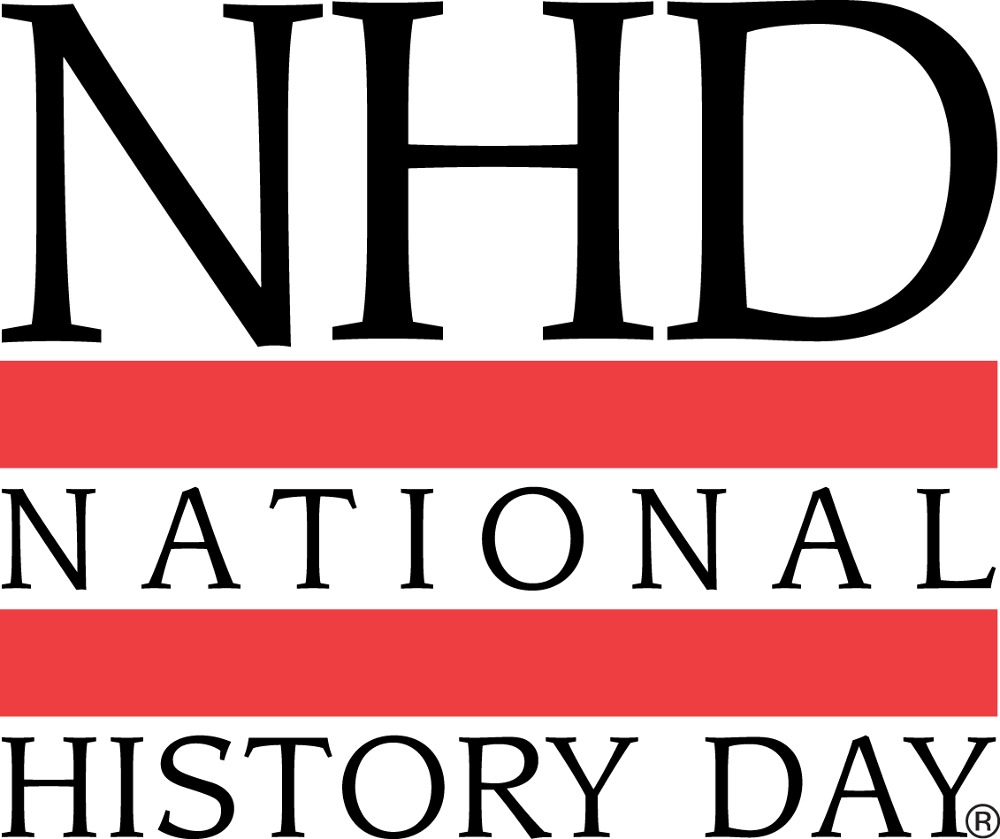
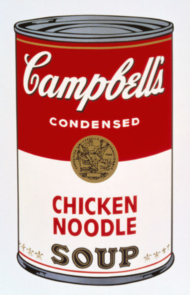

  
What is National History Day? 
---
 National History Day is a competition in which students from around the world compete by researching a historical topic and presenting it in one of four categories: paper, documentary, exhibit, or performance. Students in middle and high school can participate, and they can either compete individually or in a group. Students must place in school and affiliate competitions before they can move on to the national competition in Maryland. 

My partner and I competed at the national national level competition with a documentary on the explorations, encounters, and exchange of Pop Art.

Image Credit: [National History Day](https://www.nhd.org/)

Researching and Editing 
---

Because of our combined interest in art, my partner and I decided to create a documentary about pop art. 
After months of research, drafting, and editing we had a documentary to present to the world. We also went above and beyond by buying matching pop art shirts so we had matching outfits during our interviews. 

What did I learn?
---
Participating in the National History Day competition helped me to develop my professionalism and improve my communication skills. One of the unique challenges of writing a script for a video, was trying to balance creating a factually correct yet interesting and easily understood message. We solved this by including interviews. I learned what were the 'right' kinds of questions to ask during an interview, as well as how to push an interview in the direction you wanted it to go. 

