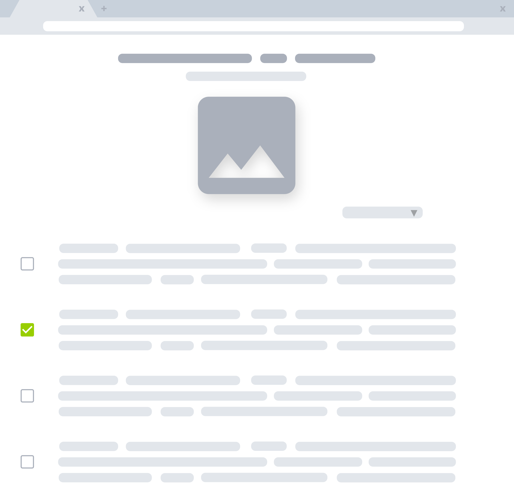

A Bit About Books for Bows
---

Books for Bows is a marketplace for University of Hawai’i students to buy and sell textbooks. We are "Books for Bows" because we serve the Rainbow Warriors (AKA 'Bows) of the University of Hawai'i. Our web application allows UHM students to create and edit their own listings for textbooks, as well as browse through a marketplace of textbooks and compare listings. 

Often times, shopping for textbooks can be confusing, difficult, and frustrating. Our app addresses these concerns by providing a convenient marketplace that connects buyers and sellers, as well as providing course information for each textbook.  

Call Me Buttah, Because I'm On A Role: 
---

I did the most heavy lifting in the designing department. I designed the Landing page, header, and footer.

I drew our first mockup pages, as well as the icons on the landing page, the "No Cover Available" image, and the icon (and by extension, the favicon). 

  
  
  

I had a hand in creating the user profile page, as well as some of the default data. I also updated the [Books for Bows Information Page](https://books-for-bows.github.io/) as the project progressed. 

What did I learn?  
---
The best part was being able to put my Adobe subscription to use! I'm kidding of course. Overall, I had so much fun working with my teammates. Two of them are also my coworkers; it's reassuring that we can work together under pressure! Through this project, I am grateful for the opportunity to learn. Not only did I have to code things outside my comfort zone, I also experimented with new features on Github that streamlined the collaborative effort that was our project. I think our cute little Books for Bows is a great start to a future of Software Engineering!

View [Books for Bows](https://books-for-bows.meteorapp.com/#/)!

View The [Books for Bows Information Page](https://books-for-bows.github.io/)!

View [Our Github Repos](https://github.com/books-for-bows/)!

