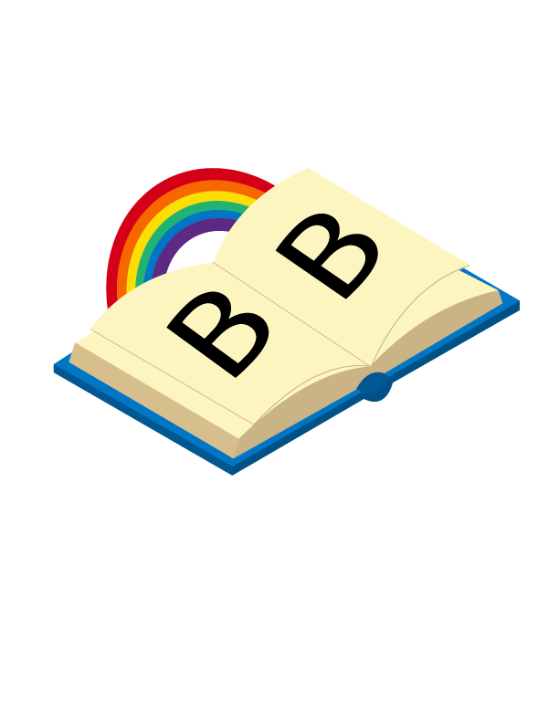
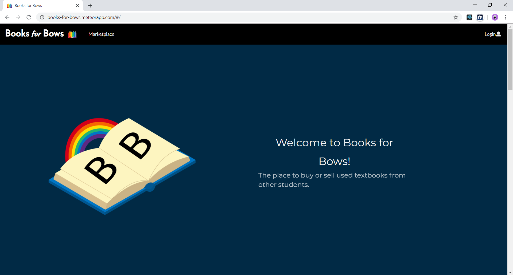

A Bit About Books for Bows
---

Books for Bows is a marketplace for University of Hawai’i students to buy and sell textbooks. We are "Books for Bows" because we serve the Rainbow Warriors (AKA 'Bows) of the University of Hawai'i. Our web application allows UHM students to create listings for textbooks, as well as view all available listings for textbooks. 

Often times, the shopping for textbook can be confusing, difficult, and frustrating. Our app tries to address these concerns by providing a convenient marketplace that connects buyers and sellers, as well as providing course information for each textbook.  

Call Me Buttah, Because I'm On A Role: 
---

What did I learn?  
---

View [Books for Bows](https://books-for-bows.meteorapp.com/#/)!

View The [Books for Bows Information Page](https://books-for-bows.github.io/)!

View [Our Github Repos](https://github.com/books-for-bows/)!

